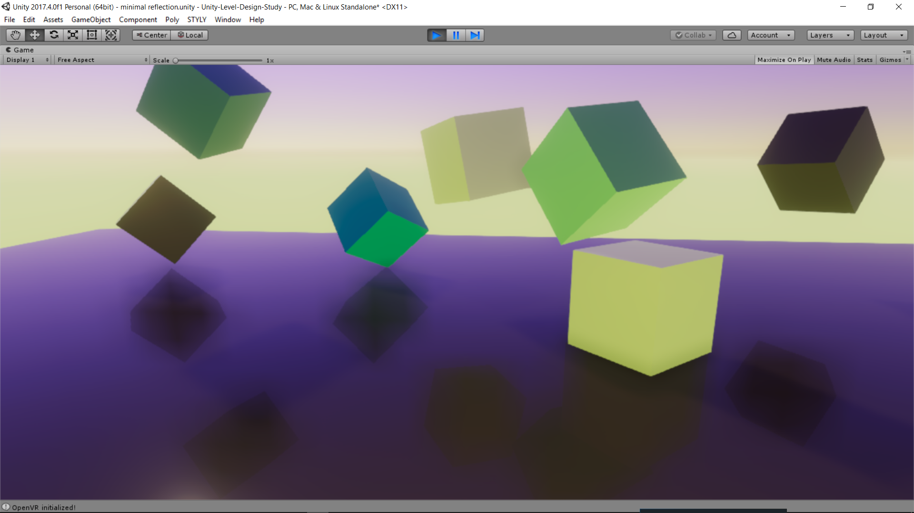
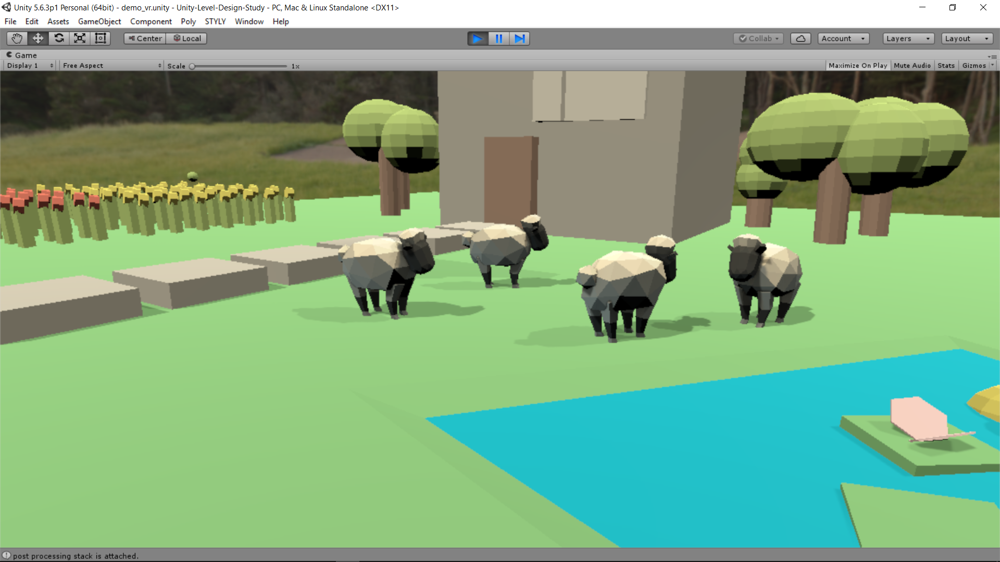

# Unity-Color-Grading(Level Design)
I wanted to explore how the postprocessing stack could change the renderd image in Unity. Several screenshots are shown below, which might help you understand each diffrence. Hope that would help you develop cool stuff ;)
## samples
### Minimal Cubes

- [Minimalist color palettes](https://www.behance.net/gallery/32154055/Minimalist-Color-Palettes-2015) 
- Reflective floor(reflection probe: light mat size = 1024) + two directional lights (two shadow sources) + point light(currently one) + ambient light
  *[Reflective floor](http://twiik.net/articles/realtime-reflections-in-unity-5)

### sheeps
#### ambient light

#### post processing stack

Video on [YouTube](https://youtu.be/eSRw67ZwLzI)

## Creative Commons [CC-BY](https://creativecommons.org/licenses/by/3.0/legalcode)
- [Abstract Art](https://poly.google.com/view/d3uGg-s0ZcF) is created by [Jarlan Perez](https://poly.google.com/user/4lZfAdz3x3X) Google under a CC-BY license
- [Sheep](https://poly.google.com/view/aWFQcDSaDyo) is created by [Poly by Google](https://poly.google.com/user/4aEd8rQgKu2) under a CC-BY license
